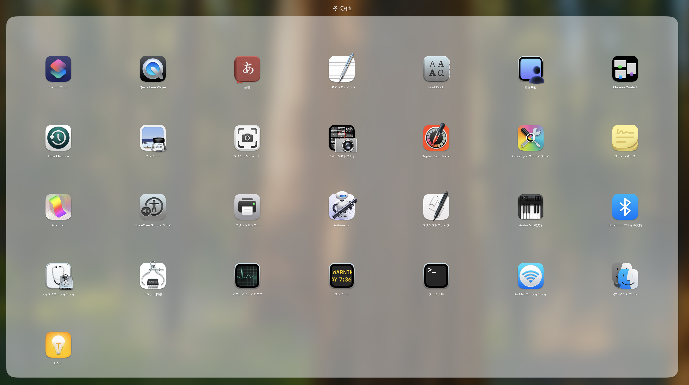
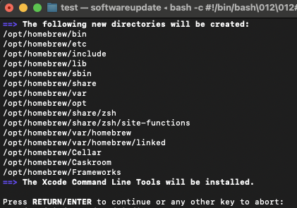
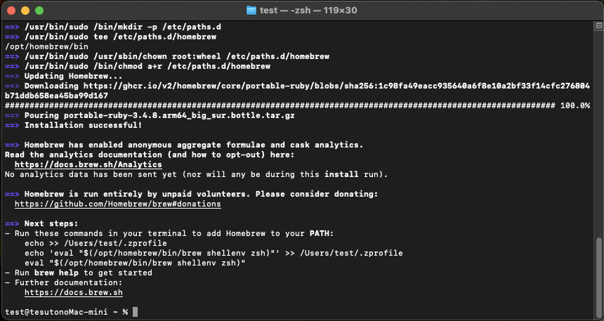
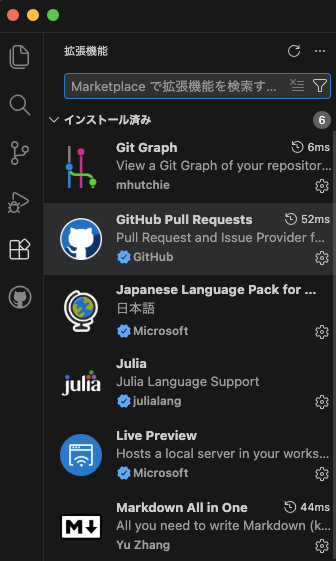
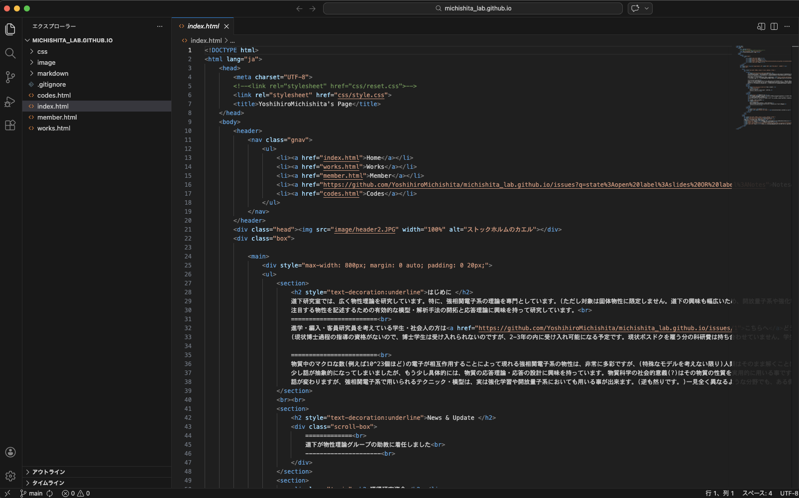

# PCセットアップ & あれこれ

研究室において、環境を統一しておくと、問題が発生した際の対応や、情報の共有・適用が楽である。ここでは研究室での基本的なPCの使用に耐える環境構築について記しておく。

(以下ではターミナルのコマンドをいくつか知っておいて貰う必要がある。`cd ~`でディレクトリを`~`に移動, `ls`で今のディレクトリ中のファイルを表示, `vi ~`で`~`を`vim`で開くことが出来る。また`vim`でファイルを開いている時のコマンドとして、`i`を押すと`insert`モードになり、文字を打ち込めるようになり、`escape`キーを押して`insert`モードを解除できる。また通常のモードで`:wq`を打てば保存して`vim`を終了する事が出来る。何か操作をミスった時は通常モードで`:q!`を打てば、編集を全て破棄して`vim`を終了することが出来る。とりあえず最初はこれくらい知っておけば何とかなる。)

強いこだわりがあれば、適時自分の好みに変えても良い(がそこで問題が発生した際は、自分で責任を持って解決すること。)

## 作業チェックリスト

- [ ] [homebrewのインストール](#Homebrewのインストール)
- [ ] [gitのインストール・設定](#gitのインストール・設定)
- [ ] [githubの登録](#githubの登録)
- [ ] [chromeのインストール](#chromeのインストール)(必要なら)
- [ ] [VSCodeのインストール](#VSCodeのインストール)
- [ ] [Juliaのインストール](#Juliaのインストール)
- [ ] [連絡・発表ツールのインストール](#連絡・発表ツールのインストール)
- [ ] [Git/Githubを使って道下研のHPのMemberページを更新してみよう](#Git/Githubを使って道下研のHPのMemberページを更新してみよう)
- [ ] [わかりにくかった部分があれば追記しよう](#わかりにくかった部分があれば追記しよう)

---

## Homebrewのインストール
今後諸々のアプリケーション・パッケージをインストールする際に便利なので入れておく。
[公式HP](https://brew.sh/ja/)の手順に従い、インストール。(以下は公式と同じ手順。)

ターミナルを開く。(初めてMacを触る人向けに説明しておくが、ターミナルはLaunchpadのその他の中から開ける)

ターミナルで以下を実行。
```
/bin/bash -c "$(curl -fsSL https://raw.githubusercontent.com/Homebrew/install/HEAD/install.sh)"
```
を実行。Xcode Command Lineをインストールするか聞かれるので、そのままEnterを押す。



その後、homebrewのパスを通すコマンドを打っといてねと言われるので、言う通りに以下を実行。



```
echo >> /Users/test/.zprofile
echo 'eval "$(/opt/homebrew/bin/brew shellenv zsh)"' >> /Users/test/.zprofile
eval "$(/opt/homebrew/bin/brew shellenv zsh)"
```
(そのままコピペして実行すれば良い)

## gitのインストール・設定

最近のMacにはgitが最初から入っているようです。なので設定だけ。

以下をターミナルで実行。
```
git config --global user.name "(your name)"
git config --global user.email (email-adress)
```
`(your name)`には自分の名前を、`email-adress`にはメールを入れておく。(とりあえず大学のメールアドレスで良い。)

## githubの登録
論文を書く際に、論文に使ったソースコードを共有する際に使う。(自分で趣味で色々開発する際にも使えるし、自分のHP作って遊ぶ事も出来る。)

共同執筆や研究室Webサイトの運営にも使うので登録する事。

1. [HP](https://github.co.jp/)に飛んで、SignUpをクリック。
2. Googleでログインを選択する。(メールアドレスとUsernameが勝手に埋められる。そのままだとUsernameが長いので新しく短いものに書き換えておこう)(大学のe-mailで登録しても良いが、卒業時に使えなくなるので、gmailで登録しておく事を勧める。)
3. 自分のローカルのPC(のターミナル)からgithubにアクセス出来るようにしておく。[このサイト](https://docs.github.com/ja/authentication/connecting-to-github-with-ssh/generating-a-new-ssh-key-and-adding-it-to-the-ssh-agent)の「SSHキーを生成する」から「SSH接続をテストする」までを実行しておく。


## chromeのインストール
chromeの拡張昨日を使いたい時はインストール。一応MacだとSafariの方が省エネ・省メモリ。Webアプリ等を使う際にSafariだと動かない事もある。
[ここ](https://www.google.com/chrome/)からインストール。


## VSCodeのインストール
コーディングや論文書き等に便利なので入れてもらう。せっかくhomebrewをインストールしたので使ってみよう。
```
brew install --cask visual-studio-code
```


## Juliaのインストール
科学計算においてバランスの取れたプログラミング言語。最初にコレに触っておくと他の言語も学びやすいのでオススメ。

ターミナルで以下を実行。
```
curl -fsSL https://install.julialang.org | sh
```
どういう構成でインストールするか訊かれるので、一番上のデフォルト構成でインストールする。

インストールが終わったら、指示通り
```
. /Users/test/.zshrc
```
を実行して、
```
julia
```
と打って、`julia`が起動するかを確かめる。(`exit()`で`julia`から抜け出せる。)

## 連絡・発表ツールのインストール
物性理論全体の連絡ツールとしてElement, 道下研の連絡ツールとしてTeamsを入れておく。発表のためのスライド・ポスター作成ツールとして、PowerPointを入れても良い(MacではKeynoteがデフォルトで入っているので、それを使っても良い。)


## Git/Githubを使って道下研のHPのMemberページを更新してみよう
今後しばしばGit/Githubを使うことがあるので、練習として、道下研のHPのMemberのページを更新してもらいます。

コード周りを保存するディレクトリを作る。(僕は大体書類(Documents)ディレクトリを使っている。)

[HPのリポジトリのページ](https://github.com/YoshihiroMichishita/michishita_lab.github.io/tree/main#)に行き、`git clone`するためのURLを手にいれる。(今後のために教えておくと、`Code`ボタンを押して、`ssh`を選択するとURLが表示される。)
そしてそのURLを使って以下を実行。
```
cd~/Documents
git clone git@github.com:YoshihiroMichishita/michishita_lab.github.io.git
```
これでgithub上で公開されているリポジトリをローカルなディレクトリにコピーすることが出来た。これをVSCodeで開こう。
```
cd michishita_lab.github.io
code .
```
以下の作業の経過を見やすくするためにVSCodeにいくつか拡張機能をインストールしよう。左端の四角が四つ集まったボタンを押して、以下の６つの拡張機能をインストールしておこう。(名前を検索してインストールすれば良い。GithubPullRequestについてはインストール後にログインする必要がある。(左下に①が出てくるのでそこからログイン出来る。))



これらを入れた後に、下図の右上にある虫眼鏡のアイコンをクリックすると、HTMLファイルから実際のHPで表示される画面を生成することができる。


さてここからブランチを切って自分の作業ブランチを作成し、そこで自分の自己紹介を追記し、リポジトリにプルリクエスト(更新のリクエスト)を送ってみよう。

以下を実行。(yournameは自分の名前を入れておく)
```
git switch -c (yourname)-introduction
```
これで`(yourname)-introduction`という名前のブランチが作成され、自分の居場所もそこに移った。ここでどれだけファイルの編集をしようともとの`main`ブランチのファイルが変更されることはない。試しに
```
git branch
```
と打ってみると、`main`と今作ったbranchが表示され、作った方のブランチの名前の横に`*`マークが付いているはずだ。`*`マークのブランチのファイルを現在表示・編集していることを示している。

このブランチで、`member.html`を編集し、自分の自己紹介を追記してみよう。(htmlの書き方は雰囲気でやってください。。)
編集が終われば、VSCode左端のソース管理アイコンをクリックし、変更の右側の「全ての変更をステージ」ボタンをクリックし、変更をステージングする。その後メッセージに自分が何を変更したのかを記述し、コミットボタンを押す。今回は試しに`add yourname member`とかのメッセージにしておこう。

そのままリモートにブランチを発行するを選択すると右下に「PullRequestを作成しますか？」と出てくるので、「はい」を押して、適当にコメントを書いて提出する。(ブランチの発行には権限が必要なので、Githubに登録したらGithubのアカウント名を道下に伝えること。)これを道下が承認すれば、`main`ブランチに変更が統合され、HPに変更が反映される。

## わかりにくかった部分があれば追記しよう
研究室の最大のメリットは情報の共有です。もしこのセットアップでわかりづらかった部分があれば、ご自由に追記してください。道下研HPのリポジトリのmarkdownディレクトリの中にもファイル(setup.md)が存在するので、HPの更新と同様の手順で更新してみてください。
